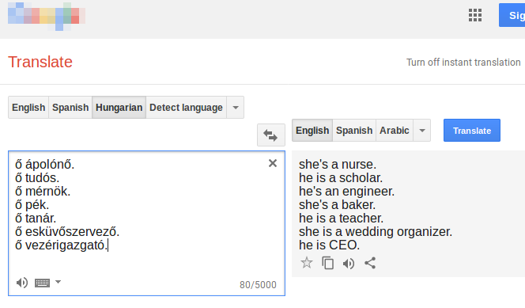

# Investigando Viés de Gênero em Tradução Automática -- Um Estudo de Caso com o Google Tradutor

Na última década, as tecnologias digitais têm sido revolucionadas por uma área de estudo da ciência da computação conhecida como "aprendizado de máquina". Em termos simples, aprendizado de máquina consiste na tentativa de produzir sistemas que aprendam a resolver problemas por meio de exemplos. Essa perspectiva vai na contramão da tradição clássica da inteligência artificial, que consiste na descrição explícita (passo-a-passo) da resolução de um problema pelo programador. Obviamente, aprendizado de máquina (ou *deep learning*, em inglês), tem muitas vantagens sobre as técnicas tradicionais, pois nos permite produzir um sistema capaz de resolver problemas *cujo passo-a-passo da resolução eventualmente nós mesmos não entendemos*.

|
:---:
 |
Considere o problema de classificar um número desenhado à mão. É bastante difícil descrever exaustivamente, passo-a-passo, de que maneira analisar os pixels da imagem de modo a obter uma classificação. Mesmo no caso do dígito zero (um dos formatos mais simples), é preciso considerar todas as possíveis irregularidades e variações na tentativa de se desenhar um círculo (e é preciso tomar bastante cuidado para que não classifiquemos um zero como um nove ou um seis, por exemplo). No entanto, hoje em dia esse problema pode ser resolvido de maneira muito rápida e simples usando técnicas de aprendizado de máquina. Basta que tenhamos acesso a um conjunto de dados contendo múltiplos exemplos de imagens, anotadas com os números que elas representam, e o sistema será capaz de aprender a mapear as imagens para as suas respectivas classes. |

Vários problemas práticos, de relevância social e/ou comercial têm sido atacados usando técnicas de aprendizado de máquina nos últimos anos. Um exemplo notório é reconhecimento facial (reconhecer uma pessoa através de uma foto do seu rosto), uma aplicação usada por redes sociais artificiais como o Facebook. Possivelmente o exemplo mais notório de aprendizado de máquina hoje em dia são os próprios mecanismos de busca (ex. Pesquisa Google), que são treinados com dados de usuários para montar um "perfil de busca" para cada usuário e aprender a condicionar os resultados das pesquisas de acordo com o que o usuário já pesquisou no passado. Um treinamento semelhante é adotado por sites de redes sociais (ex. Facebook e Instagram), que são treinados com dados de bilhões de usuários para montar uma linha do tempo cujo objetivo é maximizar a atividade ou tempo de uso do usuário na plataforma.

No entanto, recentemente estudiosos não somente da inteligência artificial como de vários outros campos, incluindo as ciências humanas, têm alertado para o fato de que o aprendizado de máquina é uma faca de dois gumes. Ainda que hoje em dia as técnicas de aprendizado de máquina estejam por trás de tecnologias e indústrias que movimentam bilhões de dólares todo ano, a dependência progressiva da nossa sociedade em sistemas treinados via exemplo traz consigo diversos problemas. Um dos problemas mais notórios, de claro impacto social, é o que chamamos *viés de máquina*. Ele se refere ao fenômeno pelo qual sistemas treinados via exemplo acabam herdando vieses presentes nos dados de treinamento. Em 2017, o sistema Google Fotos, que usa reconhecimento facial para organizar de maneira automática a biblioteca pessoal de fotos de cada usuário, foi acusada de classificar pessoas de tom de pele escuro como gorilas. A acusação provocou reações muito fortes, pois uma interpretação ingênua seria de que o sistema foi explicitamente *programado* para classificar pretos e pardos dessa maneira. Um entendimento básico de aprendizado de máquina nos permite entender que esse comportamento na verdade tem relação com o fato de que os engenheiros responsáveis pelo sistema o alimentaram com um conjunto de treinamento enviesado, que provavelmente tinha baixa representação de pessoas pretas ou pardas em proporção a caucasianos. A partir do momento que o sistema não é alimentado com esses exemplos, a sua capacidade de identificar pretos ou pardos como seres humanos se torna limitada, e algum nível de erro é esperado. Deste modo, a questão se torna um pouco mais sutil: em se tratando de aprendizado de máquina, os possíveis preconceitos dos engenheiros por trás do sistema não se manifestam ativamente, mas passivamente. A indiferença com relação à representatividade de todas as etnias no conjunto de treinamento se manifesta de maneira não-antecipada no produto final, com implicações possivelmente traumáticas para os seus usuários. Esse exemplo se soma a um número de outras acusações recentes, como a de um preditor de reincidência criminal que, se sugere, acusa pretos e pardos como mais prováveis de reincidir num crime, comparados com caucasianos com as mesmas características e o sistema de reconhecimento do Iphone X, acusado de não ser capaz de distinguir duas pessoas asiáticas diferentes uma da outra.

|
:---:
 |
a |